# Arquitectura Completa — MappingAndroid

> Aplicación Android de video-mapping en tiempo real con soporte multi-dispositivo (Servidor/Cliente), renderizado OpenGL ES 2.0 y sincronización de estado por WebSocket.

---

## Estructura de Módulos Gradle

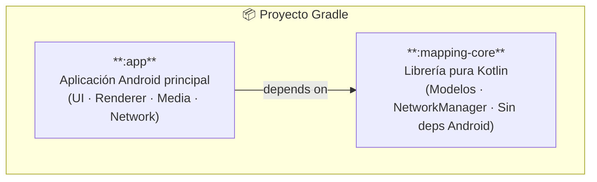

---

## Arquitectura General por Capas

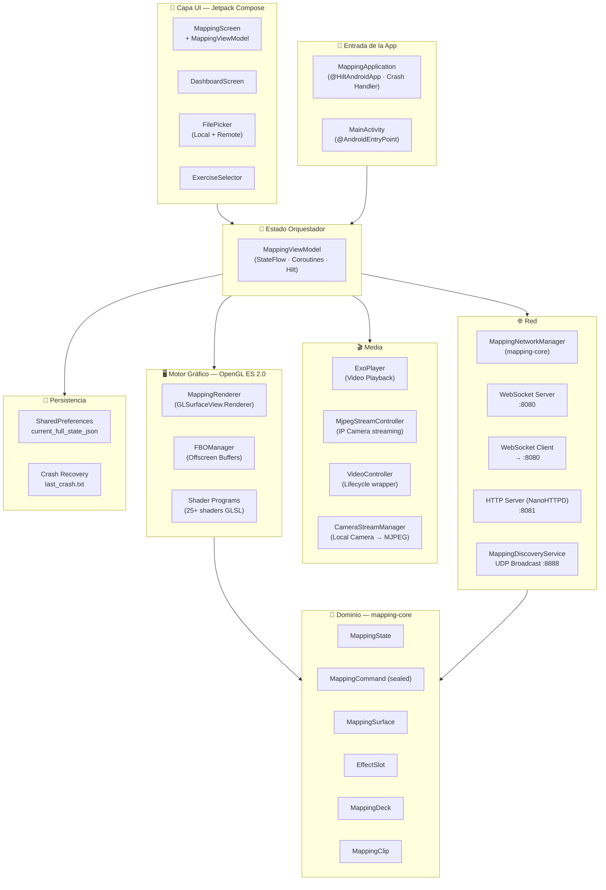

---

## Modelos de Dominio (mapping-core)

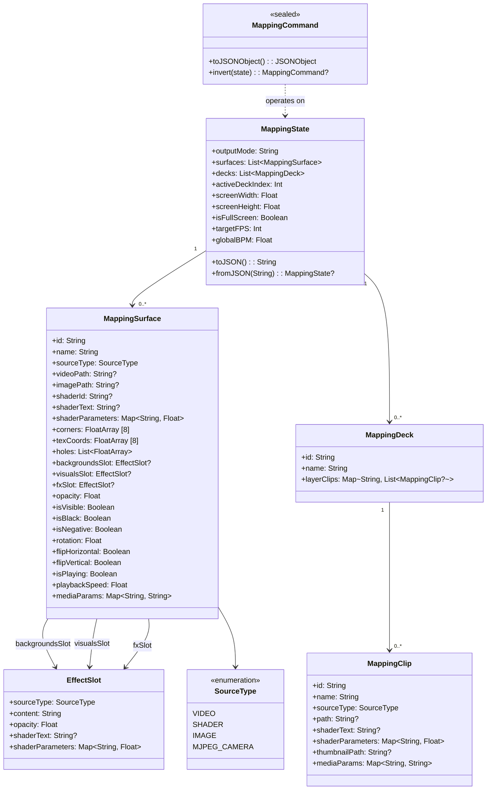

---

## Comandos del Dominio (MappingCommand)

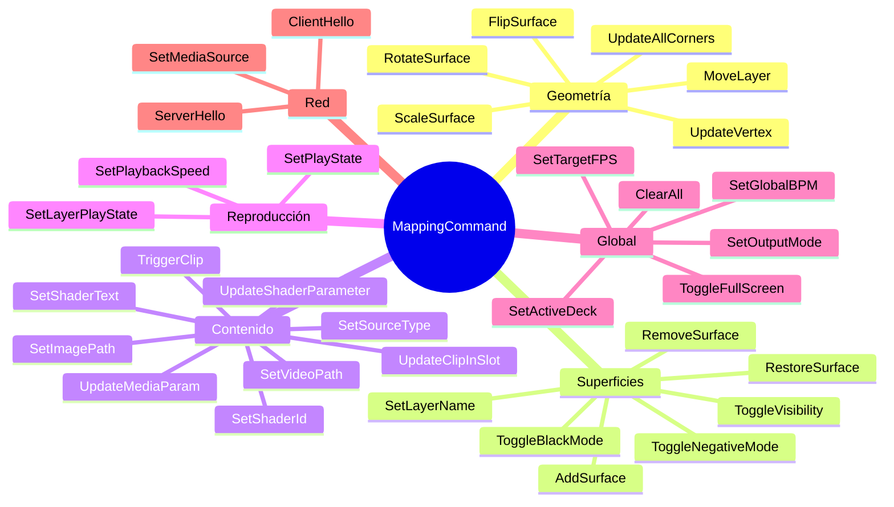

---

## Capa de Red

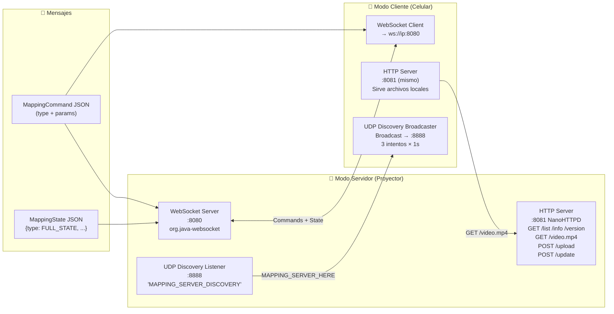

---

## Motor OpenGL ES 2.0 (MappingRenderer)

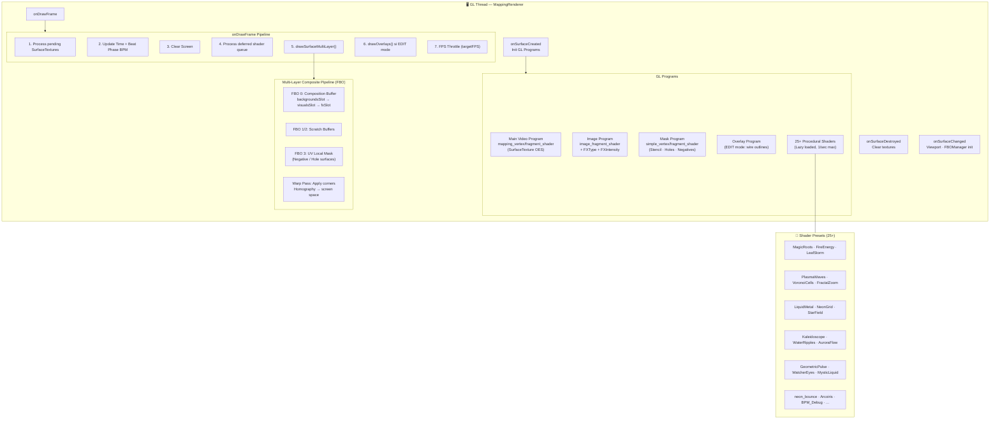

---

## FBOManager — Renderizado Multi-capa

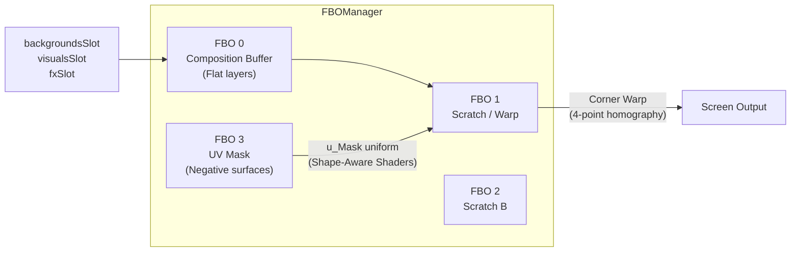

---

## MappingViewModel — Orquestador Central

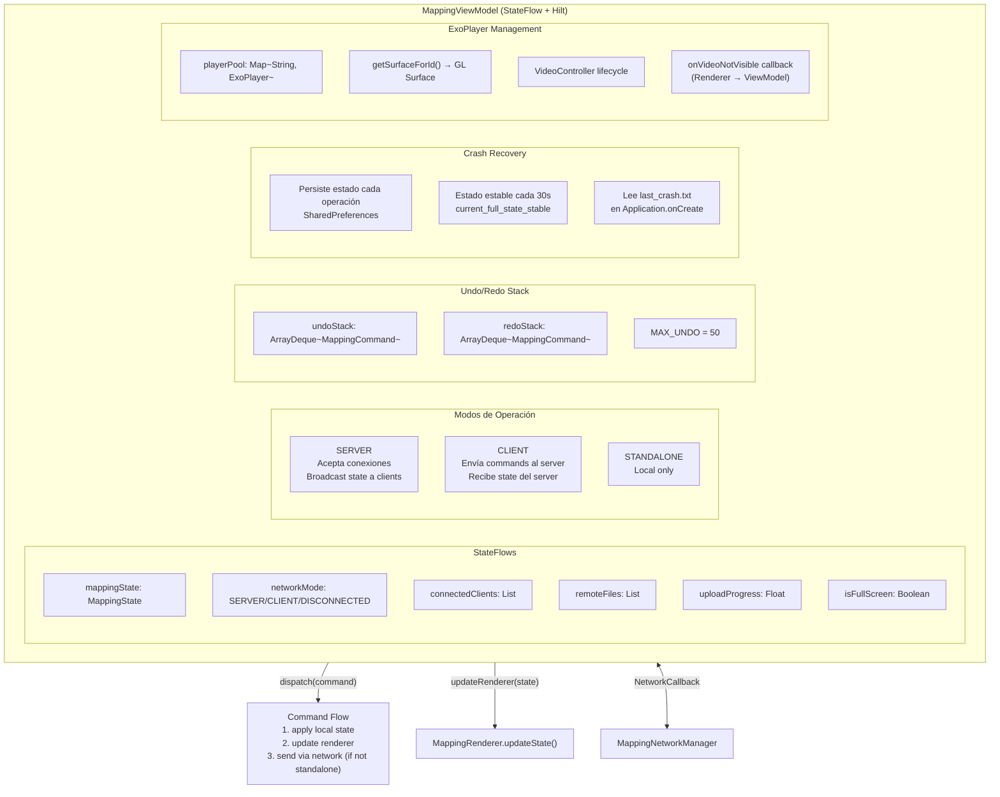

---

## Pantallas UI — Jetpack Compose

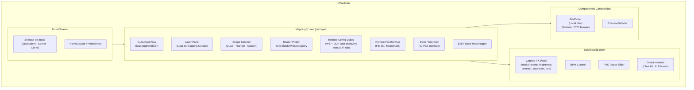

---

## Flujo de Datos Completo

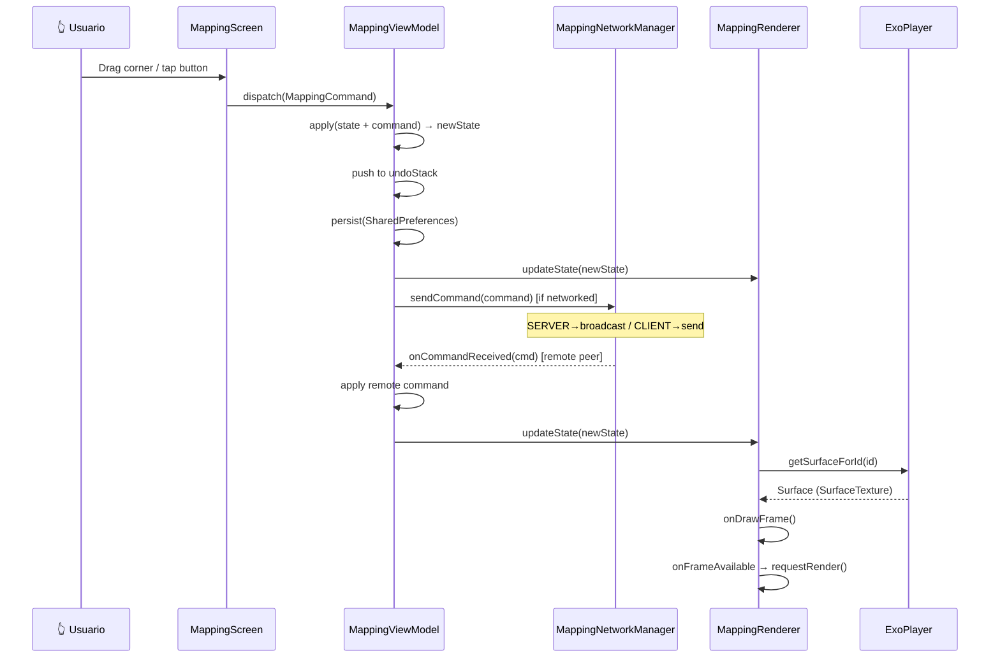

---

## Persistencia y Recuperación de Crashes

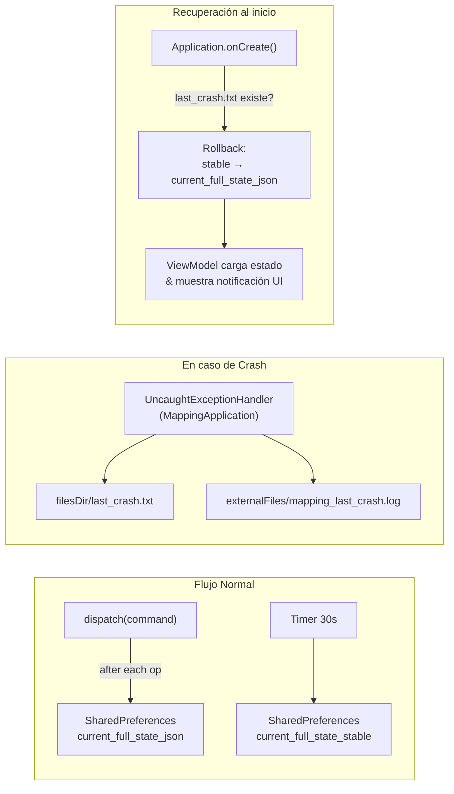

---

## Resumen de Tecnologías

| Capa | Tecnología |
|---|---|
| UI | Jetpack Compose + Material 3 |
| State Management | ViewModel + StateFlow + Hilt DI |
| Gráficos | OpenGL ES 2.0 · GLSurfaceView · FBO |
| Video | ExoPlayer (Media3) |
| Cámara IP | MJPEG over HTTP |
| WebSocket | org.java-websocket |
| HTTP Server | NanoHTTPD |
| Discovery | UDP Broadcast (:8888) |
| Persistencia | SharedPreferences |
| Serialización | JSON (org.json) |
| Concurrencia | Coroutines · GL Thread · Main Thread |
| DI | Hilt |
